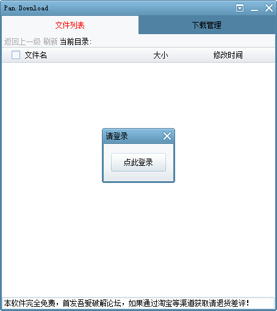
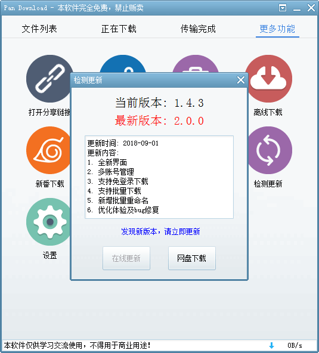
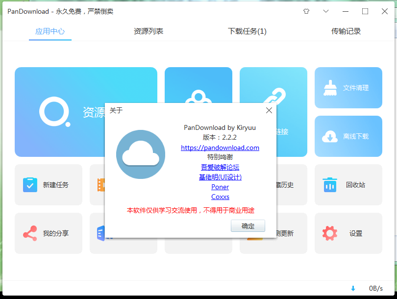
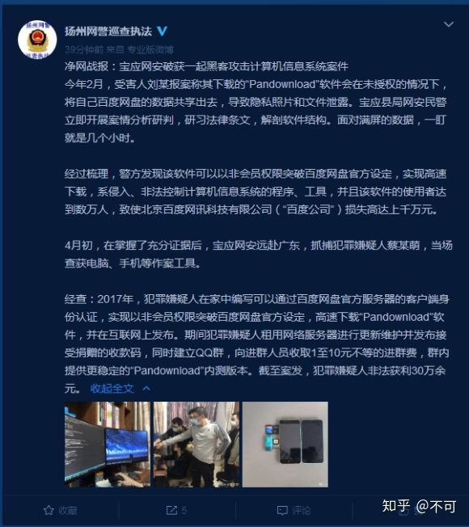

## pandownload之墓

# pandownload 2017-2020

## 2017-02-19

pandownload 1.1发布
     
     新增了网页登陆功能
     新增更新检测
     已支持XP系统

### 2017-02-26

pandownload 1.1.1发布

    添加了文件搜索功能

### 2017-05-26

pandownload 1.3.1

    优化主菜单
    新增自动关机
    新增剪贴板监控
    新增文件图标
    新增最小化到托盘
    新增新番下载
    支持自定义分享密码
    支持打开分享链接
    
### 2017-06-23

pandownload 1.3.5

    新增远程下载
    优化下载功能
    
### 2017-09-16

pandownload 1.4.3

    优化软件界面
    新增离线下载
    新增我的分享
    支持自定义aria2配置
    支持文件复制和移动操作
    支持提取下载链接
    添加提示音效
    

      
### 2017-11-22

pandownload 1.4.7

    支持在线解压500M以内压缩包
    支持查看文件属性
    文件校验时显示校验进度
    
### 2017-12-26

pandownload 1.4.9

    修复部分可能导致下载错误的问题
    
### 2018-01-13

pandownload 1.5

    修复部分用户获取下载链接失败的问题
    
### 2018-02-16

pandownload 1.5.2

    修复Bug

### 2018-03-10

pandownload 1.5.4

    修复分享链接打开失败的问题
    
## 2018-09-01

pandownload 2.0.1

    全新界面
    多账号管理
    支持免登录下载
    支持批量下载
    新增批量重命名
    优化体验及Bug修复
    

### 2018-09-29

pandownload 2.0.3

    优化使用体验及Bug修复
    新增资源搜索功能

### 2018-11-16

pandownload 2.0.5

    支持HTTP/HTTPS下载
    新增文件清理功能
    新增提取码查询功能
    
### 2019-02-04

pandownload 2.0.6

    新增批量转存功能
    支持多账号文件搜索
    优化使用体验及Bug修复
    
### 2019-04-12

pandownload 2.0.9

    支持远程下载
    修复部分Bug
    
### 2019-04-22

pandownload 2.1

    修复Bug
    
### 2019-06-22

pandownload 2.1.1

    新增收藏夹和历史记录功能
    秒传链接功能优化
    修复部分Bug
    
### 2019-08-22

pandownload 2.1.3

    修复Bug
    
## 2020-01-24

pandownload 2.2.2
### pandownload 最后一版

    界面优化
    修复Bug
    

## 2020-02

### 刘某以pandownload泄露个人信息为由向扬州警方报警

## 2020-4-15

### 扬州警方跨省抓捕作者蔡某萌并发表微博，但后期微博被删

## 2020-4-15至今
### 知乎上出现各种关于pandownload作者被抓的提问
